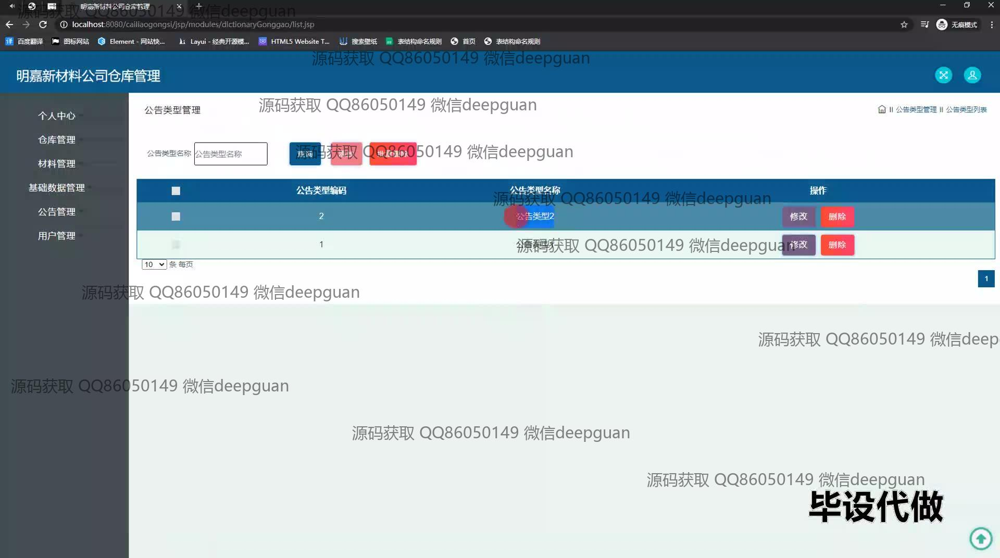
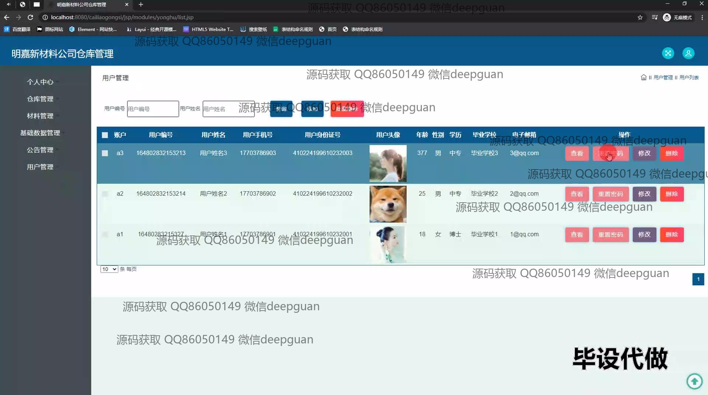
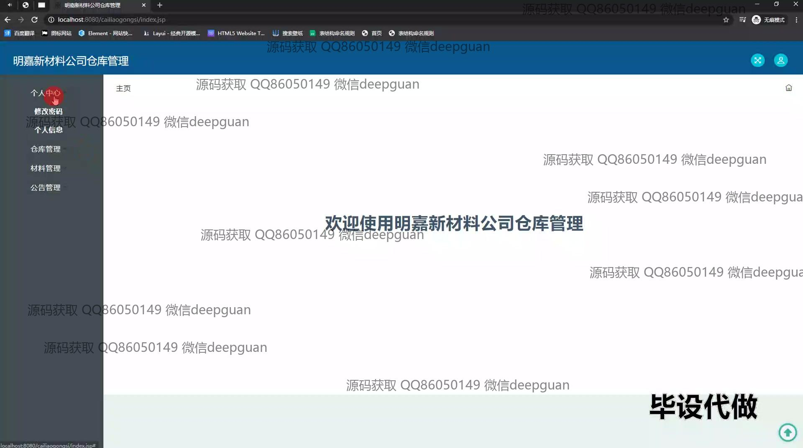
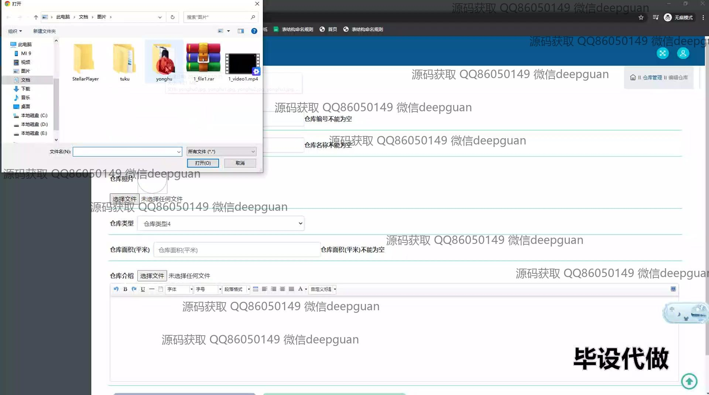
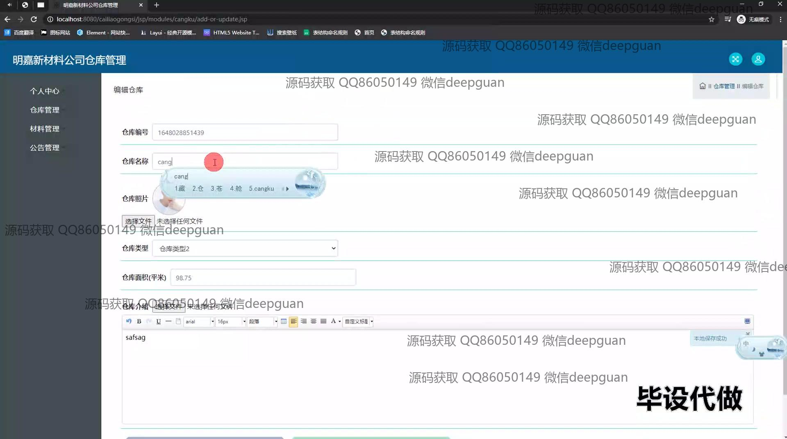
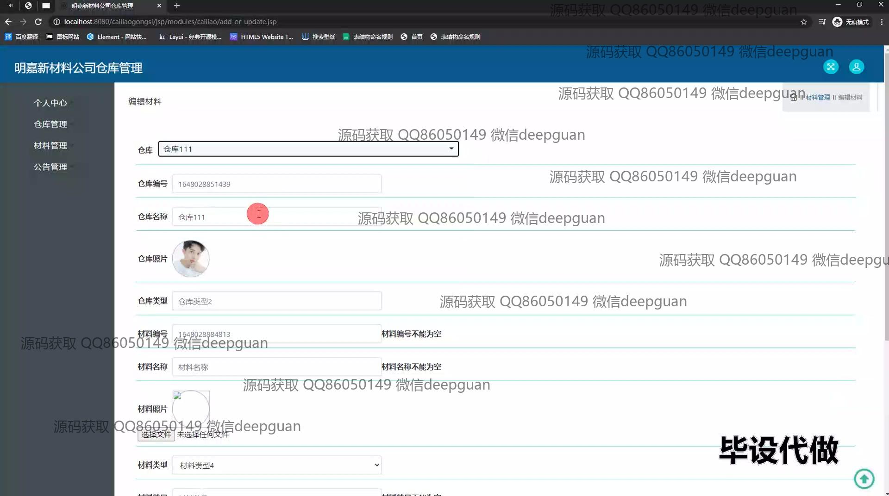
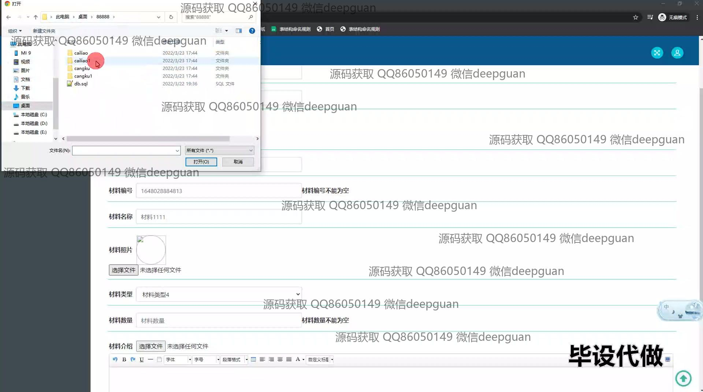
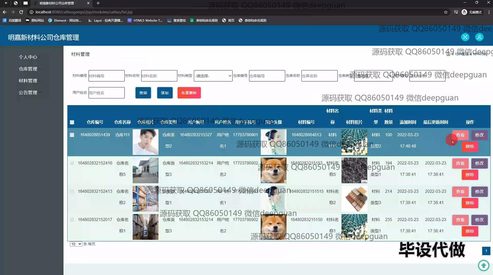
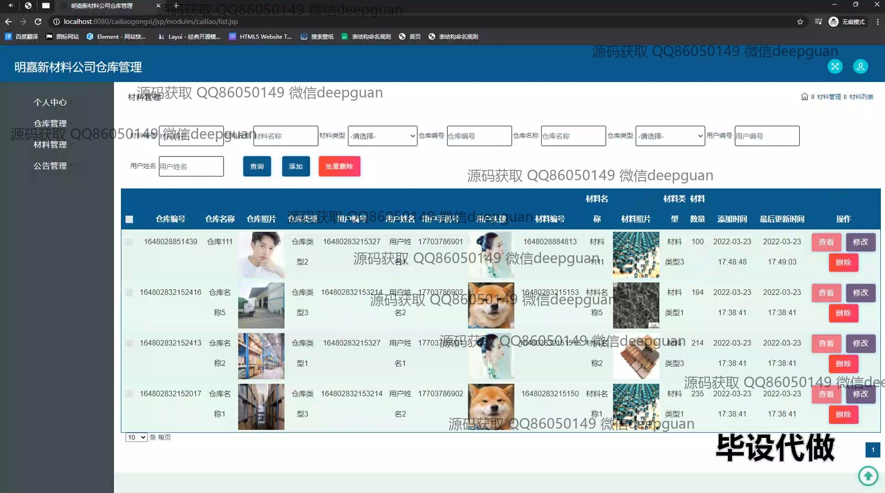

<h1 align="center">明嘉新材料公司仓库管理的设计和实现+jsp</h1>

## 简介
明嘉新材料公司仓库管理系统：角色分为管理员、用户；支持仓库管理、材料管理、用户管理、公告管理、数据批量操作、文件上传等功能。    --计算机毕业设计源码；毕设源码；java毕业设计源码

## 联系方式

<h3 align="center">获取完整代码与数据库文件 + 微信：deepguan QQ: 86050149 QQ群: 783742310</h3>

<h3 align="center">可帮忙远程部署 包运行成功！提供远程部署、修改代码、设计文档指导、代码讲解等服务！</h3>

## 功能介绍（完整见运行截图）
管理员：负责管理仓库和材料信息，包括公告类型管理、用户管理、材料管理和仓库管理等。管理员可以通过系统界面查看和编辑仓库和材料的详细信息，包括仓库编号、名称、类型、用户信息以及材料编号、名称、类型和数量等。管理员还可执行增删改查操作，包括批量删除，重置用户密码和管理用户身份信息。此外，管理员能够添加公告类型并对其进行管理。用户：用户可以通过系统进行仓库和材料信息的查看和操作。用户界面提供了登录和注册功能，用户可以查看个人信息和订单历史。同时，用户能够在系统中查看公告信息并进行相关操作，如查询和修改个人信息。系统界面简洁友好，支持材料信息的录入及上传相关文件，用户可以通过从导航菜单访问各项管理功能模块，如个人中心、仓库管理和数据查询功能。

## 运行截图

本代码来源于网络,仅供学习参考使用!

